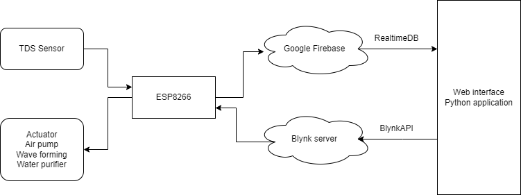

# Final Project for the IOT Lab: Aquarium
This is the project for learning purpose only
#How to use?
First, there is a link for web application: https://kiettrantuan3007.github.io/iotlab.github.io/
We deployed it on Github (this resposity)

Secondly, if you want to run the python app, please go to /build directory to view all code and how to run it (read README.md in that directory) 
# Diagram for whole project

Functionalities:
- ESP8266 will get the value from TDS sensor every 1s and push that data to Google Firebase RealtimeDB.
- The web interface will get data from Google Firebase RealtimeDB to display it, and every data change in Firebase RealtimeDB, the web will automatically update by the .onValue method supplied by Google. With Python Application, functionalities is the same.
- After that, we will set up the Blynk and ESP8266 to turn on/off actuator. To send request turn on/off by web interface or Python application, we use an API supplied by Blynk documentation via HTTP request. If we cannot turn on/off in Python Application (the code response is not 200), the error message will be displayed.
- If the value from TDS is not suitable for fish, the warning will display below, the boudary value which fit for fish habitat is:  
o With oxygen: 11-14ppm 
o With water quality: 150-250ppm (follow to TDS sensor) 
o With pH: 6.5 – 9 

The value above is varied in terms of what kind of fish you are keeping

# Code for ESP8266 at dir /ESP8266
The code for the ESP8266 we uploaded to directory /ESP8266/dht11_firebase.ino
